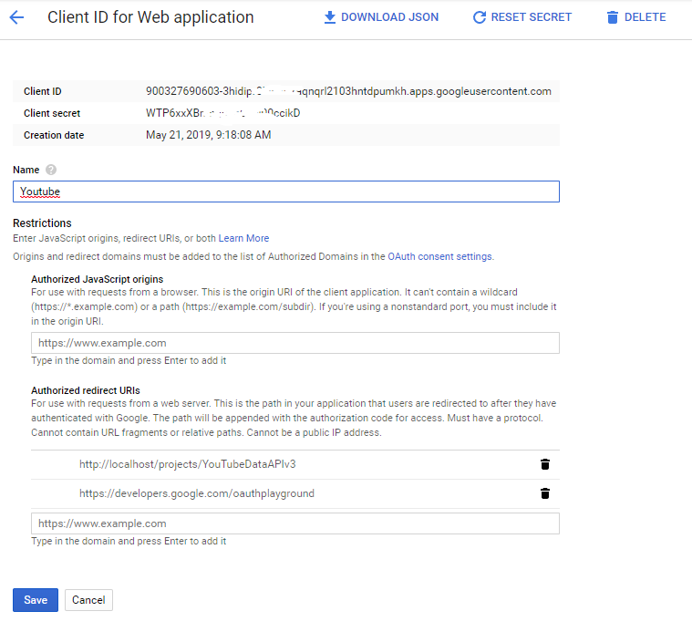
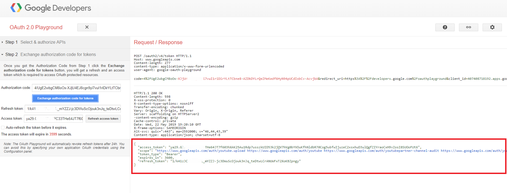

# YouTubeAPIv3
The documentation provided by you tube for PHP is not very clear and descriptive on how to use the you tube's API. So i made this for people who are having difficulty using it

YouTubeAPIv3
The documentation provided by YouTube for PHP is not very clear and descriptive on how to use the you tube's API. So i made this for people who are having difficulty using it

## Prerequisites:
   1. Make sure you have **[Composor](https://getcomposer.org/download/) installed** Go to this [Link](https://getcomposer.org/download/) **OR** To quickly install Composer in the current directory, run the following script in your terminal.

    php -r "copy('https://getcomposer.org/installer', 'composer-setup.php');" 
    php -r "if (hash_file('sha384', 'composer-setup.php') === '48e3236262b34d30969dca3c37281b3b4bbe3221bda826ac6a9a62d6444cdb0dcd0615698a5cbe587c3f0fe57a54d8f5') { echo 'Installer verified'; } else { echo 'Installer corrupt'; unlink('composer-setup.php'); } echo PHP_EOL;" 
    php composer-setup.php php -r "unlink('composer-setup.php');"

## STEPS
1. **Obtain OAuth 2.0 credentials from the Google API Console.**

    Visit the Google API Console to obtain OAuth 2.0 credentials such as a client ID and client secret that are known to both Google and your application. The set of values varies based on what type of application you are building. For example, a JavaScript application does not require a secret, but a web server application does.

    Applications that use languages and frameworks like PHP, Java, Python, Ruby, and .NET must specify authorized redirect URIs. The redirect URIs are the endpoints to which the OAuth 2.0 server can send responses. For testing, you can specify URIs that refer to the local machine, such as [http://localhost:8080] Make sure to add Your authorized redirect URIs and the [oauthplayground](https://developers.google.com/oauthplayground/) URIs because we are going to use google [oauthplayground](https://developers.google.com/oauthplayground/) to manually start the process.

2. **Clone the repository**

    After you clone the repo,Run `composer install` (on your local machine) to install the required packages and generate a composer.lock file.

3. **After creating your credentials, download the client_secrets.json file and securely store it in a location that only your application can access.**

    In this case download it and store it inside the **assets/** folder and name it **client_secrets.json**

4. **Create a new file called tokens.json**

    Navigate to the **assets/** folder and create a file with name **tokens.json**, keep the file open because we are going to add the access token and refresh token maually generated with oauthplayground

5. Navigate to [oauthplayground](https://developers.google.com/oauthplayground/) click on this [Link](https://developers.google.com/oauthplayground/)

   1. Go to the OAuth2 Playground via this link, which should pre-populate some key values for you.

   2. Click the gear icon  icon in the upper right corner and check the box labeled **Use your own OAuth credentials** (if it isn't already checked).

   3. Make sure that:

      1. **OAuth flow** is set to **Server-side**.
      2. **Access type** is set to **Offline** (this ensures you get a refresh token and an access token, instead of just an access token).
      3. Enter the **OAuth2 client ID** and **OAuth2 client secret** you obtained **step3**. playground settings 
   4. In the section labeled Step 1 - Select & authorize APIs,or enter the following URL in the text box at the bottom, if it's not already there, then click Authorize APIs:
      https://www.googleapis.com/auth/youtube.upload authorize apis 

**OR**

Find the API that you want to use and select them and click **Authorize APIs** like shown in the below image

6. If prompted, log in to the account to which you want to grant access and authorization. Otherwise, confirm that the current Google user in the top right corner is the Google Ads or manager account for whom you want to obtain credentials.

>If you got your client ID and secret only a few minutes ago, and you get an error such as Error: redirect_uri_mismatch, it's possible the changes you made haven't yet propagated. Click the back button in your browser, wait a few minutes, then try clicking Authorize APIs again. If you got your client ID and secret only a few minutes ago, and you get an error such as Error: redirect_uri_mismatch, it's possible the changes you made haven't yet propagated. Click the back button in your browser, wait a few minutes, then try clicking Authorize APIs again.

7. A prompt appears indicating your app would like to **Manage your Youtube Account**. Click **Accept** to continue.

8. In the tab labeled **Step 2 - Exchange authorization code for tokens, you should now see an Authorization code.** in the below image, Click **Exchange authorization code for tokens.** 

9. If goes well, you should see the **Refresh token** and **Access token** filled in for you (you may have to re-expand **Step 2 - Exchange authorization code for tokens** to see these values): 

10. Copy the json response you get and paste it in to the file **token.json** that we create on step 4 and save the file

11. **Call the function YouTubeDataAPIv3($videoTitle, $videoDescription, $videoPath, $videoCategory);**

    *Example:* **YouTubeDataAPIv3("Test title", "Test Description", "./assets/videosfun.mp4", "27");**

# You can build more functionality on it but this will set you up the base to start

*You can contact me via* **[KiranBhattarai.me](https://www.kiranbhattarai.me)** 
